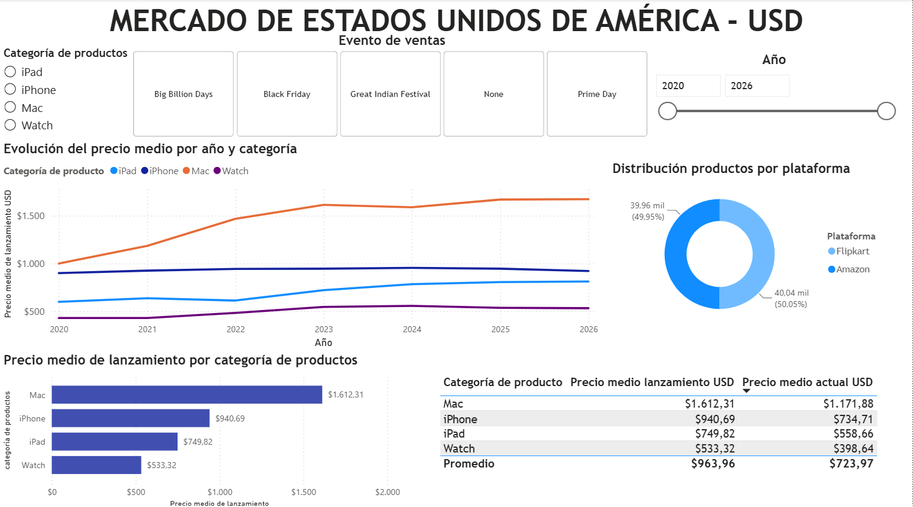
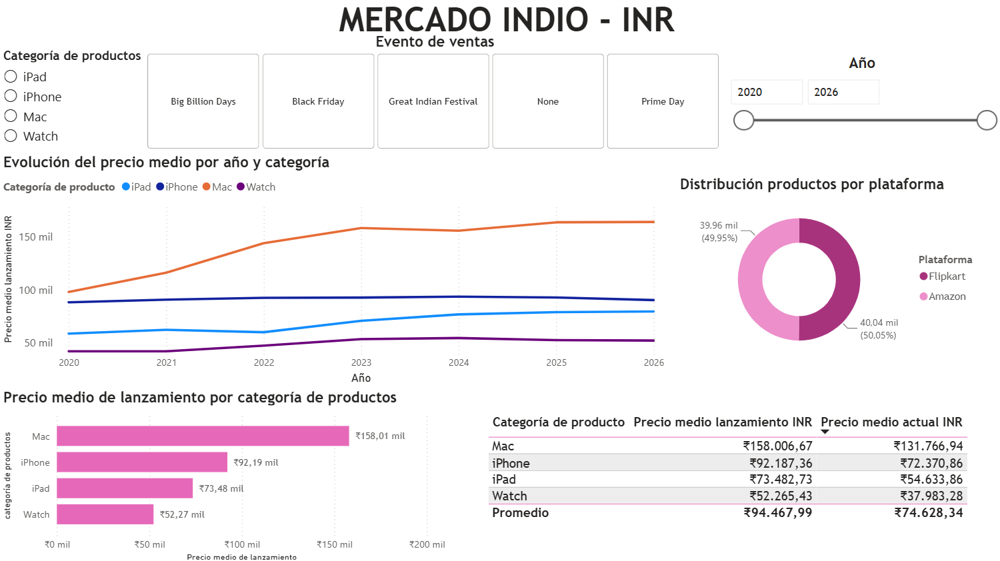
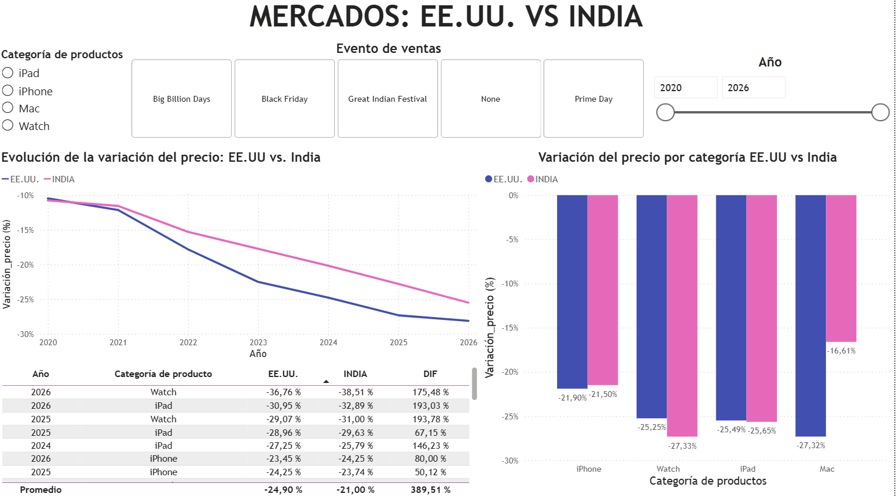
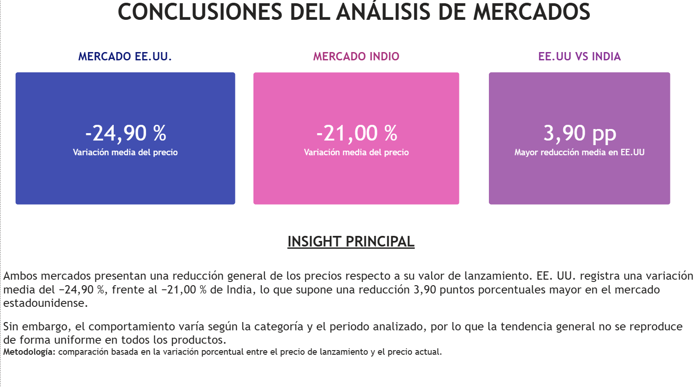

# 📊 Análisis Comparativo de Productos y Precios (EE. UU. vs. India)

Proyecto de análisis de datos desarrollado con **Power BI** para estudiar la evolución de los precios de productos tecnológicos en los mercados de **Estados Unidos** e **India**.

El objetivo principal es comparar ambos mercados mediante indicadores porcentuales, evitando que las diferencias entre divisas condicionen el análisis.

---

# 🎯 Objetivos

- Analizar la evolución del precio medio de lanzamiento por categoría de producto.
- Comparar el precio de lanzamiento con el precio actual.
- Estudiar el comportamiento del mercado estadounidense e indio de forma independiente.
- Comparar ambos mercados utilizando variaciones porcentuales.
- Obtener conclusiones que faciliten la interpretación de los datos.

---

# 🛠️ Herramientas utilizadas

- 📊 Power BI
- 🔄 Power Query
- 📐 DAX
- 📝 Microsoft Excel
- 🌐 Git
- 💻 GitHub

---

# 📁 Estructura del proyecto

```text
📂 DATASET
   └── Dataset utilizado para el análisis

📂 POWER_BI
   ├── Dashboard Mercado EE. UU.
   ├── Dashboard Mercado India
   ├── Comparación entre ambos mercados
   └── Conclusiones

README.md
```

---

# 📈 Contenido del dashboard

## 🇺🇸 Mercado EE. UU.

Se analiza:

- Evolución del precio medio por categoría.
- Comparación entre precio de lanzamiento y precio actual.
- Distribución de productos por plataforma.
- Influencia de los eventos de ventas.

---

## 🇮🇳 Mercado India

Se realiza el mismo análisis para facilitar la comparación entre ambos mercados.

---

## 🌍 Comparativa EE. UU. vs. India

La comparación se realiza utilizando la **variación porcentual del precio**, permitiendo comparar ambos mercados independientemente de la moneda utilizada.

Se incluyen:

- Evolución temporal.
- Comparación por categorías.
- Tabla de detalle.
- Indicadores resumen.

---

## 📌 Conclusiones

El proyecto finaliza con una página de resumen ejecutivo donde se destacan los principales resultados obtenidos durante el análisis.

---

# 💡 Principales insights

- Los precios actuales son inferiores a los precios de lanzamiento en ambos mercados.
- EE. UU. presenta una reducción media superior a la observada en India.
- El comportamiento no es uniforme entre categorías de producto.
- El uso de variaciones porcentuales permite realizar comparaciones objetivas entre mercados con diferentes monedas.

---

# 📷 Capturas del dashboard

## 🇺🇸 Dashboard EE. UU.
Análisis del mercado estadounidense mediante la evolución del precio medio, comparación entre precio de lanzamiento y precio actual, distribución por plataforma y segmentación por eventos de venta.



## 🇮🇳 Dashboard India
Análisis del mercado indio mediante la evolución del precio medio, comparación entre precio de lanzamiento y precio actual, distribución por plataforma y segmentación por eventos de venta.



## 🌍 Comparativa
Análisis comparativo de ambos mercados mediante la evolución del precio medio, comparación entre precio de lanzamiento y precio actual, distribución por plataforma y segmentación por eventos de venta.



## 📌 Conclusiones


---

# 🚀 Posibles mejoras futuras

- Incorporar indicadores financieros adicionales.
- Analizar nuevas categorías de productos.
- Automatizar la actualización de datos.
- Publicar el dashboard mediante Power BI Service.

---

# 👩‍💻 Autora

**Belén López Ruiz**

Proyecto desarrollado como parte de mi portfolio de análisis de datos.
